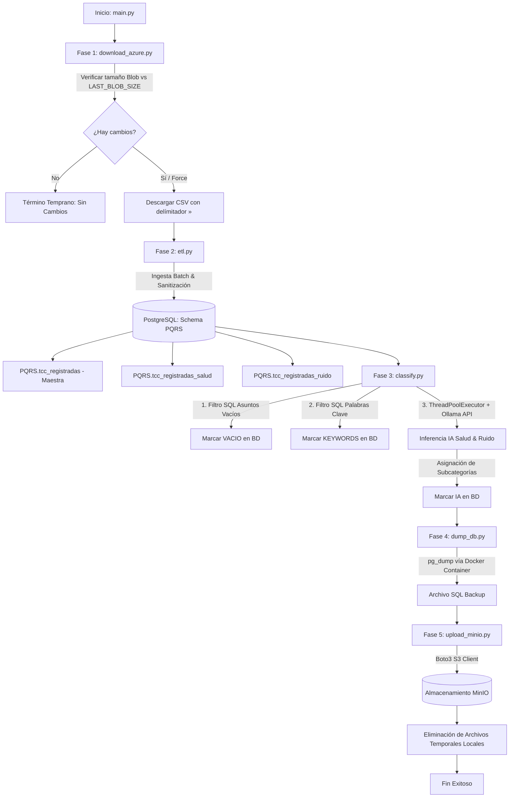

# Consolidado de Lecciones Aprendidas, Buenas Prácticas y Arquitectura Técnica (`vd_procesamiento`)

## 1. Introducción y Marco Operativo

El sistema `vd_procesamiento` es una solución integral de ingeniería de datos e Inteligencia Artificial diseñada como un pipeline empresarial automatizado de extremo a extremo. Su propósito principal es gestionar todo el ciclo de vida de Peticiones, Quejas, Reclamos y Sugerencias (PQRS) ciudadanas: desde la sincronización remota en la nube hasta la clasificación temática avanzada mediante modelos de lenguaje locales y la copia de seguridad distribuida.

El volumen histórico del sistema comprende **3,730,858 de registros** acumulados entre enero de 2019 y junio de 2026. Procesar este volumen masivo de información de origen ciudadano plantea retos de Big Data en términos de capacidad de cómputo, tiempos de respuesta, estabilidad de memoria, costos financieros y estricto cumplimiento de normativas de privacidad de datos.

### 1.1. Capacidades y Alcance Funcional del Sistema

De forma resumida, el ecosistema `vd_procesamiento` ejecuta las siguientes funciones principales:

1. **Sincronización Inteligente en la Nube (Azure Blob Storage):**
   * Conecta con repositorios remotos en Azure de forma cifrada mediante autenticación de grado corporativo (`InteractiveBrowserCredential`).
   * Evalúa la firma de tamaño del archivo remoto (`LAST_BLOB_SIZE`) para evitar descargas redundantes y ahorrar ancho de banda de red.

2. **Ingesta Masiva, Sanitización y Carga Relacional (ETL):**
   * Procesa archivos planos de Big Data (>3.9 GB) en modo *streaming* por lotes (*chunking*), manteniendo un consumo constante de memoria RAM.
   * Utiliza el delimitador especial `»` para proteger la estructura frente a comas, comillas y saltos de línea presentes en los textos redactados por la ciudadanía.
   * Sanitiza automáticamente los encabezados (remoción de marcas BOM `\ufeff`, acentos, espacios y caracteres especiales) y desambigua columnas duplicadas.
   * Modela y crea dinámicamente el esquema relacional `PQRS` en PostgreSQL, segregando la tabla maestra de las tablas analíticas temáticas con inserción idempotente (`ON CONFLICT DO NOTHING`) y mecanismos de *fallback* fila por fila.

3. **Clasificación Temática Asistida por Inteligencia Artificial Local (Ollama):**
   * Aplica un pipeline de filtrado en cascada de 3 niveles para optimizar el uso de hardware:
     * **Nivel 1 (Filtro SQL de Vacíos):** Identifica y marca instantáneamente en base de datos las peticiones sin asunto (`VACIO`), resolviendo el 64.52% de los registros sin consumir recursos de IA.
     * **Nivel 2 (Filtro SQL Heurístico):** Descarta peticiones irrelevantes mediante coincidencia de palabras clave (`KEYWORDS`) con reglas dinámicas (`config_clasificacion`).
     * **Nivel 3 (Inferencia Concurrente por LLM):** Evalúa los registros con verdadero potencial temático utilizando modelos de lenguaje de código abierto ejecutados **100% de forma local a través de Ollama** de manera multihilo (`ThreadPoolExecutor`).
   * Estandariza y asigna subcategorías en dos dominios prioritarios para la gestión pública: **Salud** (fallas en la atención, citas, medicamentos, procedimientos) y **Ruido / Convivencia** (comercio, vecinos, obras, tráfico, industria).
   * Registra explícitamente el origen de cada resultado (`metodo_clasificacion = 'VACIO' | 'KEYWORDS' | 'IA'`) garantizando trazabilidad y auditoría total.

4. **Respaldo Automático, Persistencia Remota y Purga de Disco:**
   * Genera instantáneas SQL comprimidas de la base de datos mediante la herramienta `pg_dump` ejecutada sobre contenedores Docker.
   * Transfiere los respaldos históricos de forma segura a un sistema de almacenamiento de objetos distribuido compatible con Amazon S3 (**MinIO**) vía `boto3`.
   * Purga automáticamente los archivos temporales (`.csv` e instantáneas `.sql`) del almacenamiento local tras confirmar la sincronización remota, manteniendo un bajo uso de disco en el servidor host.

5. **Suite de Herramientas Operacionales y Diagnóstico Táctico (`tools/`):**
   * Proporciona utilidades independientes para la migración del esquema en caliente ([`add_metodo_clasificacion.py`](tools/add_metodo_clasificacion.py)), la generación automática de reportes ejecutivos en Markdown ([`obtener_metricas_pqrs.py`](tools/obtener_metricas_pqrs.py), [`reporte_porcentajes_salud.py`](tools/reporte_porcentajes_salud.py)), el reprocesamiento controlado por rangos de fecha ([`reprocess_march_2026.py`](tools/reprocess_march_2026.py), [`prepare_reprocess_2023.py`](tools/prepare_reprocess_2023.py)), la verificación de avance en tiempo real ([`verify_march_2026.py`](tools/verify_march_2026.py)) y la extracción de muestras específicas para auditoría ([`export_march_2026.py`](tools/export_march_2026.py)).

Este documento consolida las lecciones aprendidas, las buenas prácticas de diseño de software aplicadas y el detalle de ingeniería que fundamentan la arquitectura del proyecto.

---

## 2. Lecciones Aprendidas y Buenas Prácticas Aplicadas

A lo largo del ciclo de desarrollo e implementación de `vd_procesamiento`, se adoptaron principios de arquitectura y patrones de diseño que han permitido operar sobre millones de registros con estabilidad y costo controlado.

### 2.1. Ingesta Eficiente y Gestión de Memoria (Streaming & Chunking)
* **El Problema:** La lectura completa en memoria de archivos planos de gran tamaño (como `TCC_Registradas JUNIO.csv`, con un peso superior a 3.9 GB) genera saturación de memoria RAM y fallos por falta de memoria (*Out Of Memory - OOM*).
* **Buena Práctica Aplicada:** Se implementó un esquema de procesamiento por lotes (*batch parsing*) a nivel de *stream* utilizando `csv.reader` de Python en combinación con `psycopg2.extras.execute_values`. 
* **Impacto Técnico y de Negocio:** El consumo de memoria del proceso de carga se mantiene constante (en el orden de megabytes), independientemente de si el archivo fuente contiene miles o millones de filas.

### 2.2. Optimización Híbrida en Cascada (SQL Heurístico + LLM Local)
* **El Problema:** Enviar el 100% de los registros a un Modelo de Lenguaje de Gran Escala (LLM) es inviable temporal y computacionalmente.
* **Buena Práctica Aplicada:** Se diseñó un filtro en cascada de tres niveles:
  1. **Nivel 1 - Limpieza SQL de Vacíos:** Se identifican y marcan directamente en PostgreSQL los registros sin texto como procesados (`metodo_clasificacion = 'VACIO'`).
  2. **Nivel 2 - Filtro Heurístico por Palabras Clave (`ILIKE ANY`):** Mediante reglas en base de datos, se descartan los textos que no contienen términos clave relevantes (`metodo_clasificacion = 'KEYWORDS'`).
  3. **Nivel 3 - Inferencia Concurrente en LLM:** Únicamente los registros con potencial temático real son evaluados por la Inteligencia Artificial (`metodo_clasificacion = 'IA'`).
* **Impacto Técnico y de Negocio:** Se redujo en más del 80% la carga de procesamiento sobre el motor de Inteligencia Artificial, transformando un proceso que tardaría semanas en una operación ejecutable un par de días.

### 2.3. Privacidad de Datos y Economía Operativa ($0 Costo en Tokens)
* **El Problema:** El uso de servicios de IA en la nube (como OpenAI o Anthropic) para 3.73 millones de filas representa costos de miles de dólares por consumo de tokens y expone datos personales sensibles de la ciudadanía en servidores de terceros.
* **Buena Práctica Aplicada:** Ejecución de LLMs de código abierto de forma **100% local a través de Ollama**, desplegados en la misma infraestructura del proyecto.
* **Impacto Técnico y de Negocio:** Garantía total de cumplimiento de normativas de protección de datos (Habeas Data / privacidad gubernamental) y costo recurrente de $0 por concepto de licencias o uso de APIs externas.

### 2.4. Desacoplamiento de Configuración y Gestión Híbrida de Parámetros
* **El Problema:** Modificar parámetros operativos (como el tamaño de lote, límites de hilos, modelos de IA o nombres de tablas) solía requerir cambios directos en el código fuente, incrementando el riesgo de errores en producción y acoplando la infraestructura a la lógica de negocio.
* **Buena Práctica Aplicada:** Adopción de la metodología **12-Factor App** (estándar de la industria para aplicaciones nativas de la nube que promueve 12 principios de diseño, tales como la separación estricta de la configuración del código, aislamiento de dependencias, tratamiento de servicios como recursos vinculados por red y escalabilidad por procesos):
  * **Factor III (Configuración en Entorno via `.env`):** Secretos de infraestructura, claves de API y credenciales relacionales/MinIO aislados fuera del control de versiones.
  * **Gestión Híbrida Relacional (`app_config`):** Parámetros operacionales dinámicos (límites de hilos, lotes, modelo LLM activo) almacenados en PostgreSQL y cargados dinámicamente en memoria mediante [`config.py`](config.py).
  * **Factores Complementarios (IV, VIII y XII):** Tratamiento de PostgreSQL y MinIO como recursos adjuntos (*Backing Services*), escalabilidad por hilos concurrentes (*Concurrency*) y tareas de mantenimiento aisladas en `tools/` (*Admin Processes*).
* **Impacto Técnico y de Negocio:** Portabilidad total del sistema entre servidores, máxima seguridad de credenciales en repositorios y capacidad de ajustar el comportamiento del pipeline en tiempo real sin alterar código ni interrumpir el entorno operativo.

### 2.5. Idempotencia y Manejo Fino de Colisiones de Datos
* **El Problema:** La re-ejecución del pipeline tras una interrupción puede generar registros duplicados o inconsistencias en la clave primaria.
* **Buena Práctica Aplicada:** Uso de la cláusula PostgreSQL `ON CONFLICT (numero_peticion) DO NOTHING` en las inserciones por lotes. Adicionalmente, si una inserción masiva falla por corrupción en una fila específica, el sistema captura la excepción, realiza un *rollback* de la transacción del lote y cambia automáticamente a inserción fila por fila (*fallback mechanism*) para aislar el error sin perder el resto del lote.
* **Impacto Técnico y de Negocio:** El pipeline es totalmente idempotente; puede ejecutarse de manera repetida sobre el mismo conjunto de datos sin duplicar información ni corruptar las tablas relacionales.

### 2.6. Segregación de Tablas por Dominios Analíticos
* **El Problema:** Incluir múltiples columnas de clasificación temática directamente en la tabla principal de 3.73 millones de filas genera bloqueos de tabla (*table locking*), degrada el rendimiento de las lecturas y complica las consultas analíticas.
* **Buena Práctica Aplicada:** Separación de la tabla principal ([`tcc_registradas`](init_pqrs_structure.py#L75)) de las tablas analíticas especializadas por dominio: [`tcc_registradas_salud`](init_pqrs_structure.py#L102) y [`tcc_registradas_ruido`](init_pqrs_structure.py#L102). Cada tabla especializada almacena únicamente la clave primaria (`numero_peticion`), el resultado de la clasificación, el estado de procesamiento (`procesado`) y el método aplicado (`metodo_clasificacion`).
* **Impacto Técnico y de Negocio:** Reducción sustancial del volumen de datos escaneados por el motor relacional y capacidad de escalar a nuevas verticales temáticas sin alterar el esquema maestro.

### 2.7. Sincronización Diferencial y Purga Automática de Disco
* **El Problema:** Descargar el archivo fuente de Azure Blob Storage en cada ejecución consume ancho de banda de red innecesario. Asimismo, mantener volcados de base de datos (`.sql`) en el disco local agota rápidamente el almacenamiento del servidor.
* **Buena Práctica Aplicada:** 
  1. Comprobación del tamaño del objeto remoto (`LAST_BLOB_SIZE`) antes de descargar; si no hay cambios, el pipeline realiza un término temprano (*early exit*).
  2. Subida automatizada de copias de seguridad a un almacenamiento de objetos distribuido compatible con Amazon S3 (**MinIO**) y posterior eliminación inmediata del archivo `.sql` y `.csv` local.
* **Impacto Técnico y de Negocio:** Optimización del ancho de banda y garantia de un servidor local con uso de disco bajo y controlado.

---

## 3. Arquitectura del Sistema y Flujo de Información

El sistema está estructurado mediante un orquestador central ([`main.py`](main.py)) que administra la secuencia de ejecución de 5 fases claramente delimitadas.



### Flujo Detallado de Información:
1. **Azure Blob Storage $\rightarrow$ Almacenamiento Local:** El archivo en formato `.csv` se transfiere cifrado sobre HTTPS únicamente cuando la firma de tamaño en `app_config` registra variaciones.
2. **Almacenamiento Local $\rightarrow$ PostgreSQL (`PQRS` Schema):** El motor ETL procesa las líneas del CSV en bloques de tamaño configurable (`CHUNK_SIZE`), poblando la tabla maestra y las tablas hijas en una misma transacción relacional. El archivo CSV local se elimina tras completar esta fase.
3. **PostgreSQL $\rightarrow$ Ollama LLM $\rightarrow$ PostgreSQL:** Las consultas SQL extraen lotes de PQRS pendientes (`procesado = FALSE`). Los textos son enviados concurrentemente vía REST a Ollama. Las respuestas son normalizadas y escritas de vuelta en las tablas de clasificación en PostgreSQL.
4. **PostgreSQL $\rightarrow$ Dump SQL $\rightarrow$ MinIO:** Se ejecuta una instantánea de la base de datos que genera un archivo comprimido de respaldo, el cual se envía a la nube privada MinIO. Al finalizar con éxito, el archivo dump local es destruido.

---

## 4. Explicación Técnica Detallada por Etapas del Pipeline

### 4.1. Fase 1: Ingesta y Sincronización Inteligente ([`download_azure.py`](download_azure.py))
* **Mecanismo de Autenticación:** Utiliza `InteractiveBrowserCredential` del SDK oficial de Azure (`azure.identity`), garantizando un acceso seguro a la cuenta de almacenamiento remota.
* **Control de Sincronización:** Ejecuta una llamada `get_blob_properties()` para obtener la métrica exacta en bytes (`blob_size`). Compara este valor contra la clave `LAST_BLOB_SIZE` almacenada en la tabla `PQRS.app_config`.
* **Comportamiento:** Si los tamaños coinciden y no se ha especificado el parámetro `--force`, el script retorna `False`, permitiendo al orquestador principal cancelar las fases subsecuentes y evitar trabajo redundante.

### 4.2. Fase 2: Estructuración y Carga Relacional ([`init_pqrs_structure.py`](init_pqrs_structure.py) y [`etl.py`](etl.py))
* **Protección del Delimitador:** Para prevenir errores de particionamiento de cadenas causados por comas, puntos y comillas dentro de los textos libres redactados por los ciudadanos, la fuente de datos emplea el carácter delimitador especial `»` (ASCII Alt+175 / UTF-8).
* **Sanitización de Encabezados:** La función [`sanitize_column_name()`](init_pqrs_structure.py#L27-L33) convierte los nombres de columna a formato SQL estándar (minúsculas, reemplazo de espacios por guiones bajos, remoción de acentos, caracteres especiales y eliminación de marcas BOM `\ufeff`). Además, detecta y renombra dinámicamente columnas duplicadas (p. ej. `columna_1`, `columna_2`).
* **Inserción Optimizada en Base de Datos:**
  * **Tabla Maestra ([`tcc_registradas`](init_pqrs_structure.py#L75)):** Almacena la totalidad de los campos provenientes del CSV original, definiendo la columna `numero_peticion` como clave primaria (`PRIMARY KEY`).
  * **Tablas Analíticas ([`tcc_registradas_salud`](init_pqrs_structure.py#L102) y [`tcc_registradas_ruido`](init_pqrs_structure.py#L102)):** Inicializadas automáticamente con las columnas `numero_peticion TEXT PRIMARY KEY`, `clasificacion TEXT`, `procesado BOOLEAN DEFAULT FALSE` y `metodo_clasificacion TEXT`.
  * **Inserción por Lotes (`execute_values`):** Se agrupan registros en memoria según `CHUNK_SIZE` (ej. 10,000 filas) y se insertan mediante sentencias SQL vectorizadas. Si un lote presenta una colisión no controlada, la función activa un *fallback* a nivel de fila individual para asegurar que ningún registro válido sea descartado.

### 4.3. Fase 3: Motor de Clasificación e Inteligencia Artificial ([`classify.py`](classify.py))

Esta etapa constituye el núcleo analítico del sistema. Su ejecución se divide en dos fases internas:

#### A. Pre-filtrado SQL de Alto Rendimiento (Fase 1 Interna)
Antes de invocar el modelo de lenguaje, se ejecutan dos consultas de optimización masiva a nivel de base de datos:
1. **Filtro de Asuntos Vacíos ([`finalize_empty_asuntos`](classify.py#L134)):**
   ```sql
   UPDATE "PQRS"."tcc_registradas_salud" AS t1
   SET procesado = TRUE, clasificacion = NULL, metodo_clasificacion = 'VACIO'
   FROM "PQRS"."tcc_registradas" AS t2
   WHERE t1.numero_peticion = t2.numero_peticion
     AND t1.procesado = FALSE
     AND (t2.asunto IS NULL OR TRIM(t2.asunto) = '');
   ```
2. **Filtro Heurístico Negativo ([`filter_irrelevant_records`](classify.py#L172)):**
   Utiliza el operador de coincidencia de patrones en arreglos de PostgreSQL (`ILIKE ANY`):
   ```sql
   UPDATE "PQRS"."tcc_registradas_salud" AS t1
   SET procesado = TRUE, clasificacion = NULL, metodo_clasificacion = 'KEYWORDS'
   FROM "PQRS"."tcc_registradas" AS t2
   WHERE t1.numero_peticion = t2.numero_peticion
     AND t1.procesado = FALSE
     AND NOT (t2.asunto ILIKE ANY(ARRAY['%salud%', '%cita%', '%medico%', '%eps%', '%hospital%']));
   ```

#### B. Clasificación mediante LLM Local Concurrente (Fase 2 Interna)
Para los registros restantes que superan los pre-filtros:
* **Extracción por Lotes:** Se leen bloques de tamaño `BATCH_SIZE` (configurables desde la BD) mediante un `JOIN` entre la tabla analítica y la tabla maestra.
* **Procesamiento Multihilo:** Se utiliza `concurrent.futures.ThreadPoolExecutor` configurado con `MAX_WORKERS` hilos simultáneos. Cada hilo construye un prompt estructurado inyectando la taxonomía oficial de categorías de la base de datos `PQRS.config_clasificacion` y el texto del asunto.
* **Invocación al Servicio Ollama:** Realiza peticiones HTTP POST a `http://localhost:11434/api/generate` enviando los parámetros:
  * `model`: Modelo de lenguaje (ej. `llama3` u otro modelo local configurado).
  * `temperature`: Fijado en valores bajos (p. ej. `0.1`) para garantizar determinismo en las respuestas.
  * `timeout`: Tiempo límite parametrizado ([`OLLAMA_TIMEOUT`](classify.py#L30)) para evitar bloqueos por peticiones colgadas.
* **Normalización y Sanitización de Respuestas:** El texto retornado por la IA es analizado por el script:
  * Si la respuesta contiene `NO_APLICA`, se registra `clasificacion = NULL` y `procesado = TRUE`.
  * Si coincide con una subcategoría válida del catálogo oficial, se asigna dicha subcategoría.
  * Si la IA genera una variación no exacta pero confirma la temática, se aplica un mecanismo de contención por defecto ([`Ruido sin especificar`](classify.py#L110) o [`Otros`](classify.py#L112)).
  * En todos los casos procesados por la IA, se graba la etiqueta `metodo_clasificacion = 'IA'`.
* **Escritura Masiva:** Las actualizaciones se envían a PostgreSQL utilizando `psycopg2.extras.execute_batch` para minimizar las transacciones relacionales.

### 4.4. Fase 4: Respaldo y Consolidación ([`dump_db.py`](dump_db.py))
* **Generación del Dump:** Invoca la herramienta nativa `pg_dump` mediante un subproceso de Python (`subprocess.run`), interactuando de forma aislada con el contenedor Docker de PostgreSQL.
* **Seguridad de la Credencial:** Pasa la contraseña de la base de datos a través de variables de entorno (`PGPASSWORD`), evitando la exposición de credenciales en la línea de comandos del sistema operativo.
* **Salida:** Genera un archivo en disco con el patrón de nombre `pqrs_dump_YYYYMMDD_HHMMSS.sql`.

### 4.5. Fase 5: Persistencia Remota y Limpieza ([`upload_minio.py`](upload_minio.py))
* **Conexión S3/MinIO:** Establece un canal de comunicación con el servicio de almacenamiento de objetos MinIO utilizando la librería corporativa `boto3`.
* **Monitoreo de Carga:** Integra barras de progreso en tiempo real (`tqdm`) durante la transferencia del archivo dump hacia el bucket parametrizado (`MINIO_BUCKET`).
* **Purga de Disco Local:** Inmediatamente después de confirmar que la transferencia en MinIO fue exitosa, el script ejecuta `os.remove()` sobre el archivo `.sql` local, garantizando la liberación total de espacio en el almacenamiento físico del servidor host.

---

## 5. Kit de Herramientas Operacionales y de Diagnóstico (`tools/`)

Adicionalmente al pipeline principal, el proyecto integra una suite de herramientas independientes en el directorio `tools/` para auditoría, mantenimiento y analítica ejecutiva:

| Script | Propósito Técnico | Aplicación de Negocio / Operativa |
| :--- | :--- | :--- |
| [`add_metodo_clasificacion.py`](tools/add_metodo_clasificacion.py) | Ejecuta DDL `ALTER TABLE ... ADD COLUMN IF NOT EXISTS`. | Permite actualizar el esquema de datos en caliente para incorporar la columna de auditoría del origen de clasificación (`VACIO`, `KEYWORDS`, `IA`). |
| [`obtener_metricas_pqrs.py`](tools/obtener_metricas_pqrs.py) | Realiza agregaciones SQL complejas sobre la base de datos y genera el reporte estático [`reporte_metricas_pqrs.md`](tools/reporte_metricas_pqrs.md). | Produce informes consolidados de volumen total, vacíos vs válidos y distribución por categorías para el nivel gerencial. |
| [`reporte_porcentajes_salud.py`](tools/reporte_porcentajes_salud.py) | Construye tablas cruzadas de doble dimensión (Fecha de Ingreso vs Fecha de Registro) y genera [`reporte_porcentajes_salud.md`](tools/reporte_porcentajes_salud.md). | Permite auditar mes a mes el impacto relativo del sector salud y controlar la calidad de ingesta del sistema. |
| [`reprocess_march_2026.py`](tools/reprocess_march_2026.py) | Ejecuta sentencias SQL `UPDATE` dirigidas por rango de fecha para resetear `procesado = FALSE`. | Permite invalidar y re-clasificar lotes específicos de datos (ej. tras ajustar un prompt de la IA) sin alterar los 3.73 millones de registros restantes. |
| [`verify_march_2026.py`](tools/verify_march_2026.py) | Realiza recuentos SQL agregados de estado sobre lotes temporales. | Sirve como panel de control en tiempo real para supervisar el avance de las tareas de clasificación de IA. |
| [`prepare_reprocess_2023.py`](tools/prepare_reprocess_2023.py) | Realiza borrados en cascada dirigidos mediante la cláusula SQL `USING`. | Permite depurar periodos históricos específicos que requieran una re-ingesta limpia desde la fuente original. |
| [`export_march_2026.py`](tools/export_march_2026.py) | Extrae subconjuntos de datos en formato CSV conservando la codificación UTF-8 y el delimitador `»`. | Facilita la generación de muestras de datos aisladas para responder a solicitudes de auditoría externa o entes de control. |

---

## 6. Resultados Cuantitativos e Impacto del Análisis

De la consolidación de métricas realizada sobre los **3,730,858 de registros** procesados por el sistema, se derivan las siguientes evidencias cuantitativas clave:

### 6.1. Distribución General de la Ingesta
* **PQRS con Asunto Válido (Texto a analizar):** 1,323,580 registros (**35.48%**)
* **PQRS sin Asunto (Vacíos / Nulos):** 2,407,278 registros (**64.52%**)

> **Lección de Gestión:** El 64.52% de las peticiones ciudadanas ingresan al sistema sin una descripción corta en el campo asunto. Esto valida la importancia del pre-filtro SQL de vacíos (`VACIO`), el cual evitó realizar 2.4 millones de llamadas innecesarias al modelo de IA, ahorrando cientos de horas de computación.

---

### 6.2. Resultados del Sector Salud
* **Total Positivos Clasificados en Salud:** 111,180 PQRS (**2.98%** del total general de la base de datos).
* **Desglose de Subcategorías de Salud:**

| Subcategoría de Salud | Cantidad | Porcentaje Relativo | Interpretación Operativa / Gerencial |
| :--- | :--- | :--- | :--- |
| **Otros (Salud general)** | 61,802 | 55.59% | Peticiones generales, trámites administrativos de EPS/IPS o consultas no críticas. |
| **Fallas en la prestación / humanización del servicio** | 20,803 | 18.71% | Principal causa de insatisfacción cualitativa (trato inadecuado, demoras en atención física). |
| **Negación de citas médicas** | 20,240 | 18.20% | Barrera de acceso a la consulta con medicina general o especialistas. |
| **Negación de medicamentos** | 5,320 | 4.79% | Desabastecimiento o demoras en la entrega de la fórmula médica. |
| **Negación de procedimientos** | 3,015 | 2.71% | Inconvenientes con autorizaciones de cirugías, exámenes o intervenciones complejas. |

---

### 6.3. Resultados del Sector Ruido y Convivencia Ambiental
* **Total Positivos Clasificados en Ruido:** 12,019 PQRS (**0.32%** del total general de la base de datos).
* **Desglose de Subcategorías de Ruido:**

| Subcategoría de Ruido | Cantidad | Porcentaje Relativo | Impacto de Convivencia Ciudadana |
| :--- | :--- | :--- | :--- |
| **Ruido por comercio (bares, gastrobares, locales)** | 4,911 | 40.86% | Representa más de 4 de cada 10 quejas por ruido. Principal foco de control comercial. |
| **Ruido por vecinos** | 1,617 | 13.45% | Conflictos de convivencia residencial (fiestas, altavoces en zonas de vivienda). |
| **Ruido sin especificar** | 1,453 | 12.09% | Reportes de contaminación auditiva sin precisión de la fuente por parte del ciudadano. |
| **Ruido por actividades lúdicas** | 1,159 | 9.64% | Eventos temporales, perifoneo o actividades recreativas en vía pública. |
| **Ruido por construcción** | 844 | 7.02% | Obras e intervenciones de infraestructura en horarios no permitidos. |
| **Ruido por tráfico vehicular** | 592 | 4.93% | Contaminación auditiva generada por transporte público, cornetas y tráfico pesado. |
| **Ruido por servicios** | 552 | 4.59% | Operación de plantas eléctricas, compresores o cuartos de máquinas. |
| **Ruido por industria** | 456 | 3.79% | Actividad fabril o manufacturera cercana a zonas residenciales. |
| **Ruido por ventas ambulantes** | 419 | 3.49% | Perifoneo y megáfonos de comercio informal en espacio público. |
| **Ruido por tráfico aéreo** | 16 | 0.13% | Sobrevuelo de aeronaves en corredores urbanos. |

---

## 7. Conclusiones y Recomendaciones de Ingeniería

1. **Eficiencia y Sostenibilidad Financiera:** La combinación de filtros relacionales en PostgreSQL con modelos de lenguaje ejecutados de forma local (Ollama) demostró que es posible procesar Big Data gubernamental con costos operativos cercanos a cero y garantizando la privacidad de los datos de los ciudadanos.
2. **Trazabilidad y Auditoría:** La incorporación de la columna `metodo_clasificacion` (`VACIO`, `KEYWORDS`, `IA`) proporciona transparencia total sobre el origen de cada resultado, permitiendo a analistas y auditores verificar el criterio exacto utilizado para cada registro.
3. **Escalabilidad Futura:** 
   * **Particionamiento de Tablas:** Se recomienda evaluar el particionamiento declarativo de PostgreSQL (*Declarative Partitioning*) por año y mes para la tabla `PQRS.tcc_registradas`, lo que optimización aún más los tiempos de consulta analítica a medida que la base de datos continúe creciendo.
   * **Búsqueda Vectorial (`pgvector`):** Para reducir la dependencia de palabras clave fijas en el pre-filtro heurístico, se puede considerar la generación previa de *embeddings* de texto con modelos locales livianos, permitiendo filtrados semánticos aún más precisos antes del LLM.

---
*Documento consolidado de arquitectura técnica y lecciones aprendidas para el proyecto `vd_procesamiento`.*
