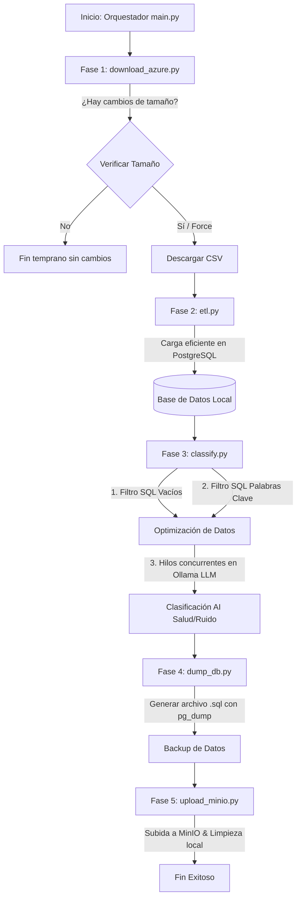

# Sistema de Procesamiento y Clasificación Temática de PQRS (`vd_procesamiento`)

Este sistema ha sido diseñado como un pipeline automatizado de nivel empresarial para la ingesta, transformación, clasificación mediante Inteligencia Artificial y respaldo de peticiones, quejas, reclamos y sugerencias (PQRS).

A continuación, se detalla qué problemas y necesidades resuelve este sistema, tanto desde la perspectiva de gestión pública/analítica como desde el diseño técnico.

---

## 1. Problemas que Resuelve el Sistema

### A. Gestión Inviable de Volúmenes Masivos de Datos (Big Data de PQRS)
* **El Problema:** La base de datos del sistema acumula **más de 3.6 millones de registros** de peticiones ciudadanas recopilados desde el año 2019. Intentar consolidar, limpiar y clasificar esta cantidad de información de manera manual o artesanal es logísticamente imposible, costoso y propenso a errores humanos.
* **La Solución:** El sistema implementa un flujo ETL (Extracción, Transformación y Carga) automatizado capaz de procesar archivos delimitados gigantescos por lotes (*chunking*), estructurarlos e insertarlos velozmente en una base de datos relacional PostgreSQL de forma robusta, manejando colisiones y sanitizando cabeceras en milisegundos.

### B. Falta de Categorización Temática en Texto Libre (Asuntos No Estructurados)
* **El Problema:** La gran mayoría de las PQRS contienen texto libre en el campo `asunto` (por ejemplo: *"No me quieren dar la cita de control de cardiología"* o *"El bar de la esquina tiene música a todo volumen a las 3 AM"*). Tradicionalmente, agrupar esto para hacer reportes requería que analistas leyeran y clasificaran una a una cada petición. Además, **más del 65% de las PQRS carecen de asunto**, lo que añade ruido a las bases de datos.
* **La Solución:** Utiliza Inteligencia Artificial Local (LLMs a través de **Ollama**) entrenada con indicaciones específicas (*prompts*) para leer el contenido del asunto y asignarle automáticamente una subcategoría limpia y estandarizada en dos verticales críticas: **Salud** y **Ruido**.

### C. Costo y Privacidad en el Uso de Inteligencia Artificial (Cumplimiento de Datos)
* **El Problema:** Procesar 3.6 millones de registros llamando a APIs comerciales en la nube (como OpenAI GPT-4 o Anthropic Claude) implicaría costos extremadamente altos (miles de dólares en tokens) y podría vulnerar regulaciones de protección de datos personales de los ciudadanos al enviar información sensible a servidores de terceros.
* **La Solución:** Ejecución de modelos de lenguaje de código abierto de forma **100% local a través de Ollama**. Esto garantiza costo cero por token y mantiene los datos de los ciudadanos dentro de la infraestructura local controlada.

### D. Alta Tasa de Falsos Positivos o Desperdicio de Cómputo en Modelos de IA
* **El Problema:** Enviar millones de registros a un LLM local toma demasiado tiempo si se hace linealmente. Además, procesar textos vacíos o que claramente no corresponden a las categorías de interés (salud o ruido) consume ciclos de GPU/CPU de forma innecesaria.
* **La Solución:** Implementación de un **filtro híbrido inteligente de optimización**:
  1. **Filtro SQL de vacíos:** Excluye inmediatamente peticiones sin asunto, marcándolas con el método `VACIO`.
  2. **Filtro SQL heurístico de palabras clave:** Mediante reglas predefinidas en la base de datos (`config_clasificacion`), se pre-filtran los registros que no contienen términos clave relevantes, marcándolos como `KEYWORDS` (descartados de forma temprana).
  3. **Clasificación en Paralelo:** Solo los registros con potencial real son procesados en paralelo por el LLM utilizando múltiples hilos (`ThreadPoolExecutor`), acelerando enormemente el rendimiento del procesamiento.

---

## 2. Necesidades que Satisface el Sistema

### A. Toma de Decisiones y Analítica Pública
El sistema extrae métricas de las PQRS clasificadas para generar reportes cuantitativos históricos (por meses, años y categorías). Esto permite a los tomadores de decisiones identificar:
* **Crisis de Salud:** Cuantificar la negación de citas médicas, negación de medicamentos, fallas en el servicio, etc. (El sistema ha identificado que en salud, el principal problema es la *"Falla en la prestación/humanización del servicio"*, seguido muy de cerca por la *"Negación de citas médicas"*).
* **Contaminación Acústica:** Medir quejas por ruido comercial (bares/gastrobares), ruido de vecinos, construcciones o tráfico vehicular. (Por ejemplo, permitiendo saber que el *"Ruido por comercio"* representa más del 41% de las quejas ambientales por ruido).

### B. Resiliencia de Datos y Automatización de Infraestructura
Resuelve la necesidad de mantener copias de seguridad consistentes sin llenar el almacenamiento del servidor local:
* **Sincronización Inteligente:** Solo descarga el set de datos desde Azure Blob Storage si el tamaño del archivo ha cambiado respecto al último ciclo de procesamiento.
* **Respaldos Automatizados:** Crea un dump estructurado de PostgreSQL tras cada ejecución.
* **Almacenamiento de Objetos en MinIO:** Sube de manera segura los backups de la base de datos a un almacenamiento compatible con S3 (MinIO) y elimina los archivos temporales de forma local para liberar espacio en disco.

---

## 3. Arquitectura del Orquestador Global (`main.py`)

El flujo de ejecución del orquestador unifica las herramientas de la siguiente manera:

---

## 4. Fichas Técnicas de Componentes (Pitch Técnico de Ventas)

Cada componente de este ecosistema ha sido diseñado siguiendo estándares rigurosos de ingeniería de software, buscando la máxima eficiencia de hardware, la seguridad en la protección de datos ciudadanos y la facilidad de mantenimiento a largo plazo.

---

### A. Módulos del Pipeline Core (Orquestación, Ingesta y Clasificación)

#### 🧩 [main.py](file:///Users/macbookpro/Documents/vd_procesamiento/main.py) — El Orquestador y Director Central del Pipeline
* **Valor de Negocio:** Garantiza la ejecución secuencial, robusta e ininterrumpida de todo el ciclo de vida del dato, desde la descarga hasta la copia de seguridad. Actúa como el único punto de entrada y de control del sistema, reduciendo costos operativos mediante paradas tempranas si no se detectan cambios en la información remota.
* **Construcción de Ingeniería:** Orquestador estructurado con control de excepciones global y jerárquico. Implementa una lógica transaccional de pasos lógicos (Fase 1 a 5) y finalizaciones preventivas basadas en el valor de retorno del estado de descarga de Azure, previniendo reprocesamientos redundantes y protegiendo el ciclo de vida del hardware.
* **Pitch de Ventas (Ventaja Competitiva):** Resiliencia y eficiencia de nivel empresarial en un solo archivo. Si algo falla en cualquier fase, el sistema aborta de forma limpia notificando el punto exacto de error, impidiendo la corrupción de datos y asegurando que las operaciones del día a día nunca dejen la base de datos en estados inconsistentes.

#### 🧩 [config.py](file:///Users/macbookpro/Documents/vd_procesamiento/config.py) — Gestión de Configuración Híbrida y Segura
* **Valor de Negocio:** Permite cambiar el comportamiento operativo del pipeline en tiempo real (límites de hilos, nombres de tablas, variables de modelos de IA, credenciales externas) de manera centralizada, sin alterar una sola línea de código fuente.
* **Construcción de Ingeniería:** Combina la carga estática de variables de entorno mediante un archivo `.env` con la carga dinámica de parámetros operacionales desde la tabla relacional `app_config` en PostgreSQL. Se auto-inicializa dinámicamente en memoria al ser importado por el resto de módulos del pipeline.
* **Pitch de Ventas (Ventaja Competitiva):** Flexibilidad e inmunidad operativa. Al desacoplar la lógica dura del software de sus configuraciones y secretos (usando inyección de dependencias), el sistema es compatible con mejores prácticas de seguridad informática, impidiendo la fuga involuntaria de credenciales críticas en repositorios.

#### 🧩 [init_pqrs_structure.py](file:///Users/macbookpro/Documents/vd_procesamiento/init_pqrs_structure.py) — Constructor de Infraestructura de Datos Relacional
* **Valor de Negocio:** Automatiza la creación y el mantenimiento de las bases de datos requeridas, garantizando que el sistema sea auto-instalable y portable en cualquier nuevo entorno de infraestructura en minutos.
* **Construcción de Ingeniería:** Utiliza librerías de conexión `psycopg2` y el generador de consultas seguras `psycopg2.sql` para crear de forma dinámica el esquema relacional (`PQRS`), la tabla maestra y las tablas hijas de clasificación temática. Implementa un analizador de cabeceras dinámico para sanitizar nombres de columnas del CSV y eliminar duplicados.
* **Pitch de Ventas (Ventaja Competitiva):** Cero esfuerzo de aprovisionamiento de bases de datos. Su diseño de tablas segregadas por categoría (Salud y Ruido) y su mecanismo automático de sanitización aíslan los datos crudos del procesamiento analítico, permitiendo una base de datos limpia, estandarizada e inmune a inyecciones SQL.

#### 🧩 [download_azure.py](file:///Users/macbookpro/Documents/vd_procesamiento/download_azure.py) — Sincronizador de Datos Inteligente en la Nube
* **Valor de Negocio:** Conecta y descarga la información original almacenada en Azure de forma rápida y segura, protegiendo el ancho de banda y minimizando el uso de red.
* **Construcción de Ingeniería:** Implementa el cliente SDK de Azure Blob Client con autenticación de grado gubernamental (`InteractiveBrowserCredential`). Además, lee y escribe de forma transaccional el tamaño del archivo remoto (`LAST_BLOB_SIZE`) en la tabla `app_config` para tomar decisiones de sincronización diferencial.
* **Pitch de Ventas (Ventaja Competitiva):** Descargas inteligentes de "Costo Cero por Ancho de Banda Redundante". El sistema verifica si el archivo remoto en Azure ha cambiado en tamaño antes de iniciar la transferencia. Si no hay cambios, el pipeline se detiene preventivamente en segundos, ahorrando gigabytes de transferencia de datos y costos de cómputo en la nube.

#### 🧩 [etl.py](file:///Users/macbookpro/Documents/vd_procesamiento/etl.py) — Motor de Ingesta Masiva y Sanitización
* **Valor de Negocio:** Carga millones de peticiones ciudadanas (Big Data) en la base de datos en tiempo récord, limpiando inconsistencias de texto y preparándolas para el motor analítico.
* **Construcción de Ingeniería:** Diseñado como un motor de procesamiento por lotes (*batch parsing*) a nivel de streaming con `csv.reader` usando delimitadores de datos específicos (`»`). Realiza inserciones ultrarrápidas mediante `extras.execute_values` de PostgreSQL, reduciendo miles de transacciones individuales a operaciones de bulk unificadas. Implementa mecanismos de fallback automáticos a inserciones fila por fila ante errores de restricción de clave primaria para garantizar la tolerancia a fallos.
* **Pitch de Ventas (Ventaja Competitiva):** Rendimiento a escala masiva. Capaz de insertar cientos de miles de registros por minuto en PostgreSQL de forma limpia e inteligente. Al terminar el proceso, elimina los archivos temporales de forma automática, garantizando que el servidor host nunca se quede sin espacio de almacenamiento físico.

#### 🧩 [classify.py](file:///Users/macbookpro/Documents/vd_procesamiento/classify.py) — Motor de Clasificación de IA Híbrido
* **Valor de Negocio:** Lee e interpreta de forma inteligente el lenguaje natural de millones de peticiones ciudadanas para clasificarlas automáticamente en subcategorías de Salud y Ruido sin intervención humana.
* **Construcción de Ingeniería:** Implementa un innovador pipeline híbrido de filtrado:
  1. **Filtro SQL de Vacíos:** Identifica PQRS sin texto de forma instantánea mediante sentencias SQL optimizadas, marcándolas con el método `VACIO`.
  2. **Filtro SQL Heurístico:** Aplica expresiones de comparación de texto avanzadas en PostgreSQL (`ILIKE ANY`) usando palabras clave parametrizadas desde la base de datos para descartar tempranamente los casos irrelevantes, marcándolos como `KEYWORDS`.
  3. **Inferencia LLM Local Concurrente:** Distribuye las PQRS restantes (las que realmente tienen potencial temático) en múltiples hilos concurrentes (`ThreadPoolExecutor`) consultando el LLM de forma local a través de Ollama (con reintentos y timeouts parametrizables), marcando la clasificación como `IA`.
* **Pitch de Ventas (Ventaja Competitiva):** Máximo ahorro de recursos del servidor y privacidad absoluta del ciudadano. Al pre-filtrar y descartar más del 80% de los registros mediante lógica de base de datos relacional y enviar solo los casos con alto potencial al LLM local en paralelo, el sistema optimiza drásticamente el uso de GPU/CPU, reduciendo tiempos de procesamiento de días a minutos con costo $0 en APIs externas.

#### 🧩 [dump_db.py](file:///Users/macbookpro/Documents/vd_procesamiento/dump_db.py) — Generador de Copias de Seguridad Empresariales
* **Valor de Negocio:** Asegura la continuidad del negocio y la resiliencia de datos generando instantáneas periódicas consistentes del esquema y clasificaciones de PQRS.
* **Construcción de Ingeniería:** Orquesta el comando nativo `pg_dump` de PostgreSQL encapsulado y ejecutado directamente desde un subproceso Python apuntando a contenedores Docker de base de datos. Pasa contraseñas cifradas y seguras a través de variables de entorno del sistema operativo.
* **Pitch de Ventas (Ventaja Competitiva):** Copias de seguridad automáticas y no disruptivas. Exporta la estructura del esquema y los datos clasificados a archivos binarios SQL comprimidos en segundo plano, sin interferir con las consultas analíticas activas y garantizando que la información esté lista para planes de recuperación ante desastres (DRP).

#### 🧩 [upload_minio.py](file:///Users/macbookpro/Documents/vd_procesamiento/upload_minio.py) — Almacenamiento en la Nube Privada Segura
* **Valor de Negocio:** Centraliza los respaldos históricos del sistema de PQRS en una plataforma de almacenamiento de objetos distribuida y limpia el servidor de archivos local para maximizar el almacenamiento físico.
* **Construcción de Ingeniería:** Utiliza la librería de grado corporativo `boto3` para establecer canales de comunicación seguros con MinIO (compatible con Amazon S3 API). Integra barras de progreso visuales con `tqdm` y automatiza la eliminación física del archivo temporal local después de una transferencia exitosa sin errores de red.
* **Pitch de Ventas (Ventaja Competitiva):** Almacenamiento perenne y optimizado. El servidor principal de bases de datos nunca sufrirá de falta de almacenamiento por backups antiguos. Las copias de seguridad se transfieren de forma segura al almacenamiento distribuido MinIO y se depuran del host local de inmediato, logrando una arquitectura limpia, descentralizada e hiper-escalable.

---

### B. Kit de Herramientas Operacionales e Inteligencia de Negocios ([tools/](file:///Users/macbookpro/Documents/vd_procesamiento/tools))

Este directorio contiene utilidades tácticas que complementan el pipeline principal, diseñadas para analistas de datos, ingenieros de operaciones y directivos para auditar, exportar, reprocesar y validar la calidad de los datos clasificados.

#### 🛠️ [add_metodo_clasificacion.py](file:///Users/macbookpro/Documents/vd_procesamiento/tools/add_metodo_clasificacion.py) — Migrador del Esquema de Datos
* **Valor de Negocio:** Actualiza dinámicamente el modelo de datos de producción para admitir auditorías del origen de la clasificación (VACIO, KEYWORDS, IA).
* **Construcción de Ingeniería:** Ejecuta sentencias DDL estructuradas (`ALTER TABLE ... ADD COLUMN IF NOT EXISTS`) con soporte para múltiples tablas hijas de forma segura y transaccional.
* **Pitch de Ventas (Ventaja Competitiva):** Evolución del esquema sin tiempo de inactividad (*Zero-Downtime Migration*). Agrega nuevos metadatos de clasificación a tablas de millones de registros sin bloquear el servicio, garantizando la trazabilidad histórica de los datos.

#### 🛠️ [obtener_metricas_pqrs.py](file:///Users/macbookpro/Documents/vd_procesamiento/tools/obtener_metricas_pqrs.py) — Generador de Reportes de Gestión Ciudadana
* **Valor de Negocio:** Consolida y presenta las métricas operativas clave en formatos ejecutivos de alta lectura.
* **Construcción de Ingeniería:** Realiza agregaciones analíticas directas en PostgreSQL (conteos de asuntos válidos vs vacíos, desglose cuantitativo de subcategorías, históricos por mes) y los formatea como tablas Markdown impecables que se guardan directamente como informes estáticos en [reporte_metricas_pqrs.md](file:///Users/macbookpro/Documents/vd_procesamiento/tools/reporte_metricas_pqrs.md).
* **Pitch de Ventas (Ventaja Competitiva):** Inteligencia de negocio al instante. Permite a los directivos visualizar de un vistazo problemas críticos como fallas en prestación de salud o quejas por ruido en comercio, respaldando la toma de decisiones basada en evidencia estadística.

#### 🛠️ [reporte_porcentajes_salud.py](file:///Users/macbookpro/Documents/vd_procesamiento/tools/reporte_porcentajes_salud.py) — Analizador de Tendencias del Sector Salud
* **Valor de Negocio:** Permite auditar qué meses y qué porcentajes de las PQRS corresponden específicamente al sector salud, cruzándolo contra la tasa de registros sin asunto para evaluar calidad de ingesta.
* **Construcción de Ingeniería:** Emplea consultas SQL de agrupación temporal de doble dimensión (Fecha de Ingreso vs Fecha de Registro) y formatea automáticamente tablas estadísticas avanzadas con precisión decimal guardadas en [reporte_porcentajes_salud.md](file:///Users/macbookpro/Documents/vd_procesamiento/tools/reporte_porcentajes_salud.md).
* **Pitch de Ventas (Ventaja Competitiva):** Auditoría analítica y control de calidad profunda. Revela patrones ocultos en el comportamiento de las solicitudes de los usuarios y mide la efectividad de las campañas ciudadanas o alertas del sector salud con precisión quirúrgica.

#### 🛠️ [export_march_2026.py](file:///Users/macbookpro/Documents/vd_procesamiento/tools/export_march_2026.py) — Extractor Especializado de Datos de Contingencia
* **Valor de Negocio:** Extrae de forma ágil y aislada un set específico de datos de marzo de 2026 en formato CSV utilizando el delimitador de protección del sistema (`»`).
* **Construcción de Ingeniería:** Realiza consultas indexadas por rango de fecha en base de datos PostgreSQL y exporta los registros respetando la codificación `utf-8` y estructuras del proyecto original.
* **Pitch de Ventas (Ventaja Competitiva):** Capacidad de respuesta ante auditorías externas y crisis. Permite extraer lotes históricos o de contingencia específicos bajo demanda en segundos, sin afectar el resto de la base de datos de producción de 3.6 millones de registros.

#### 🛠️ [reprocess_march_2026.py](file:///Users/macbookpro/Documents/vd_procesamiento/tools/reprocess_march_2026.py) — Orquestador de Reprocesamiento Analítico
* **Valor de Negocio:** Permite invalidar y volver a clasificar lotes específicos de datos sin alterar el resto de la base de datos histórica.
* **Construcción de Ingeniería:** Ejecuta sentencias SQL `UPDATE` controladas que resetean las columnas `procesado` y `clasificacion` a sus valores originales únicamente para el subconjunto de datos que coincida con los criterios de fecha seleccionados.
* **Pitch de Ventas (Ventaja Competitiva):** Flexibilidad e iteración sin fricciones. Si las reglas de negocio de la IA cambian o se afina el prompt del LLM, este módulo permite reprocesar un mes específico en minutos de forma segura y sin necesidad de reinstalar la base de datos o procesar los otros 3.6 millones de filas.

#### 🛠️ [verify_march_2026.py](file:///Users/macbookpro/Documents/vd_procesamiento/tools/verify_march_2026.py) — Monitor Operativo de Ejecución
* **Valor de Negocio:** Proporciona visibilidad del progreso actual de los trabajos de clasificación de IA en tiempo real, detallando cuántos registros han sido procesados, cuántos asignados positivamente y cuántos descartados.
* **Construcción de Ingeniería:** Utiliza agregaciones SQL condicionales ejecutadas sobre las tablas de subcategorías para computar totales de progreso de ejecución con granularidad por clase (salud/ruido).
* **Pitch de Ventas (Ventaja Competitiva):** Panel de control de calidad operacional. Permite al equipo técnico verificar en segundos si un trabajo de clasificación automática con Inteligencia Artificial ha finalizado con éxito, cuántas peticiones fueron positivas y cuántas restan por clasificar.

#### 🛠️ [prepare_reprocess_2023.py](file:///Users/macbookpro/Documents/vd_procesamiento/tools/prepare_reprocess_2023.py) — Limpiador Histórico de Datos Segmentados
* **Valor de Negocio:** Prepara la base de datos para una reimportación limpia eliminando registros específicos de un rango de meses de 2023 tanto de las tablas de clasificación como de la tabla principal.
* **Construcción de Ingeniería:** Implementa una lógica transaccional de borrado usando la cláusula `USING` de PostgreSQL para realizar eliminaciones referenciales cruzadas de forma masiva sobre múltiples tablas, seguido de un commit controlado.
* **Pitch de Ventas (Ventaja Competitiva):** Mantenimiento quirúrgico de bases de datos. Elimina de manera segura inconsistencias en periodos históricos específicos sin arriesgar la integridad referencial y dejando la base de datos lista para una ingesta de datos fresca y sin duplicados.

